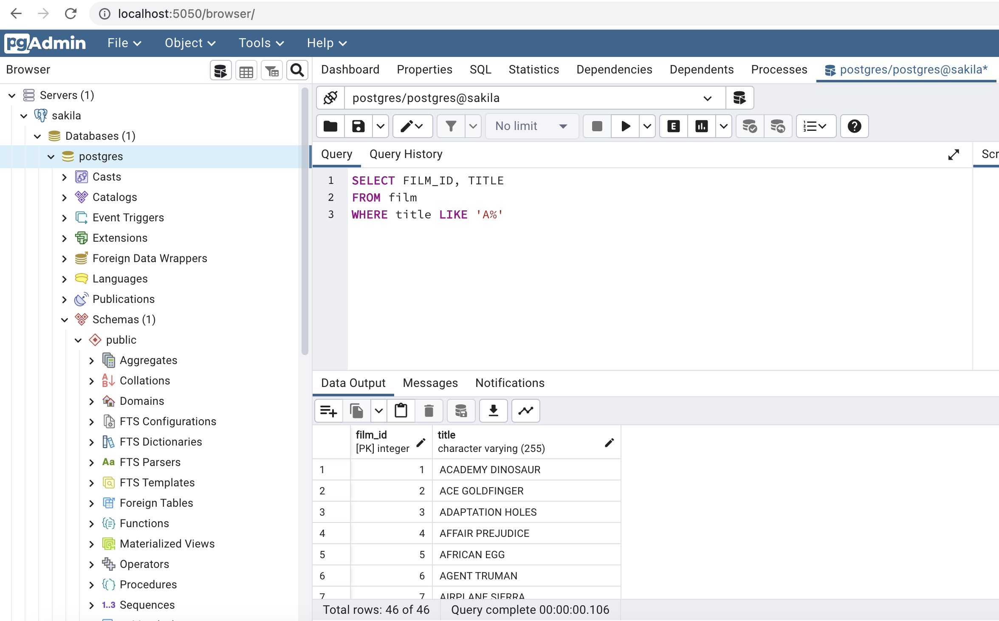

# Spring Boot - Relational Database - POC

[](https://github.com/jabrena/spring-boot-postgresql/actions/workflows/build.yaml)

A POC to review different ways to implement
the data access layer for a relational database.

## Entity Relational Diagram (ERD)

The Sakila database is a nicely normalised schema modelling a DVD rental store, featuring things like films,
actors, film-actor relationships, and a central inventory table that connects films, stores, and rentals.


## Features

- [Feature 1: Simple Query / List movies starting by A](docs/features/FEATURE_1.md)
- [Feature 2: CRUD / CRUD for the Entity Actor](docs/features/FEATURE_2.md)
- [Feature 3: Transactions with @Transactional](docs/features/FEATURE_3.md)
- Feature 4: Complex queries including join operations
- Feature 5: Distributed transactions in Modular Monoliths

Container stats:

```
CONTAINER ID   NAME                                CPU %     MEM USAGE / LIMIT     MEM %     NET I/O           BLOCK I/O         PIDS
73f16a8c3ad4   spring-boot-jdbc                    0.39%     171.3MiB / 7.764GiB   2.15%     18.6kB / 16.7kB   176kB / 676kB     38
01017c744be9   spring-data-jpa                     0.32%     223.7MiB / 7.764GiB   2.81%     42.6kB / 24.1kB   180kB / 651kB     39
357fe0f21c31   spring-data-jdbc                    0.36%     151.1MiB / 7.764GiB   1.90%     15.5kB / 13.3kB   156kB / 643kB     38
2eec46ce99d1   spring-boot-mybatis                 0.30%     176.5MiB / 7.764GiB   2.22%     1.23kB / 0B       0B / 651kB        38
ce37c7bf3509   spring-boot-postgresql-pgadmin-1    0.08%     141.8MiB / 7.764GiB   1.78%     415kB / 3.33MB    20.5kB / 12.3MB   12
967f606ef00a   spring-boot-jooq                    0.43%     207.9MiB / 7.764GiB   2.61%     15.5kB / 13.6kB   57.3kB / 668kB    38
c2305a197f88   spring-boot-postgresql-sakiladb-1   0.00%     84.61MiB / 7.764GiB   1.06%     192kB / 244kB     885kB / 426kB     48
```

## How to build in local

```bash
sdk env
mvn verify
```

# How to run the Docker Compose

```bash
docker-compose -f docker-compose.yml up -d
sleep 50
curl http://localhost:8081/api/v1/films
curl http://localhost:8082/api/v1/films
curl http://localhost:8083/api/v1/films
curl http://localhost:8084/api/v1/films
curl http://localhost:8085/api/v1/films
docker-compose -f docker-compose.yml stop
```

# How to run pgAdmin?

```bash
docker-compose -f docker-compose.yml up
http://localhost:5050/
docker-compose -f docker-compose.yml stop
```

**Note:** Review the docker compose login & establish the connection



# Dev Approach

- Run a Docker image with the Schema + a Small Testing Data to develop the feature that you need
- Develop the SQL Query
- Implement the solution in your code

# Other commands

```shell
mvn versions:display-dependency-updates
mvn versions:display-plugin-updates
```

## References

- https://docs.spring.io/spring-data/jdbc/docs/current/reference/html/
- https://docs.spring.io/spring-data/jpa/docs/current/reference/html/
- https://docs.spring.io/spring-boot/docs/current/reference/htmlsingle/#data.sql
- https://docs.spring.io/spring-boot/docs/current/reference/html/data.html#data.sql.jooq
- https://www.jooq.org/doc/3.17/manual-single-page/
- https://github.com/spring-projects/spring-data-examples
- https://mybatis.org/spring-boot-starter/
- https://mybatis.org/spring/
- https://hub.docker.com/_/postgres
- https://www.testcontainers.org/supported_docker_environment/logging_config/
- https://www.testcontainers.org/modules/databases/jdbc/
- https://docs.docker.com/compose/
- https://github.com/jOOQ/sakila
- https://github.com/fspacek/docker-postgres-sakila
- https://www.pgadmin.org/
- https://just.maciejwalkowiak.com/
- https://openapi-generator.tech/docs/generators/spring
